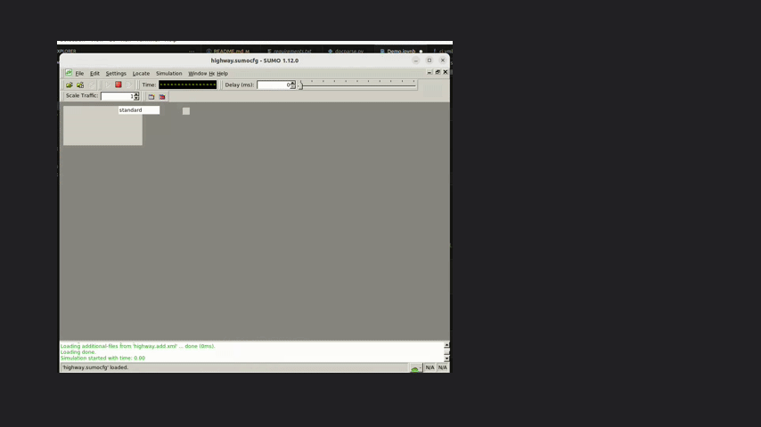
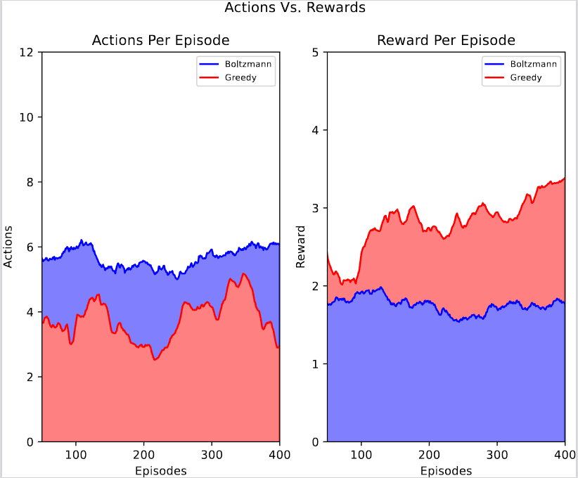
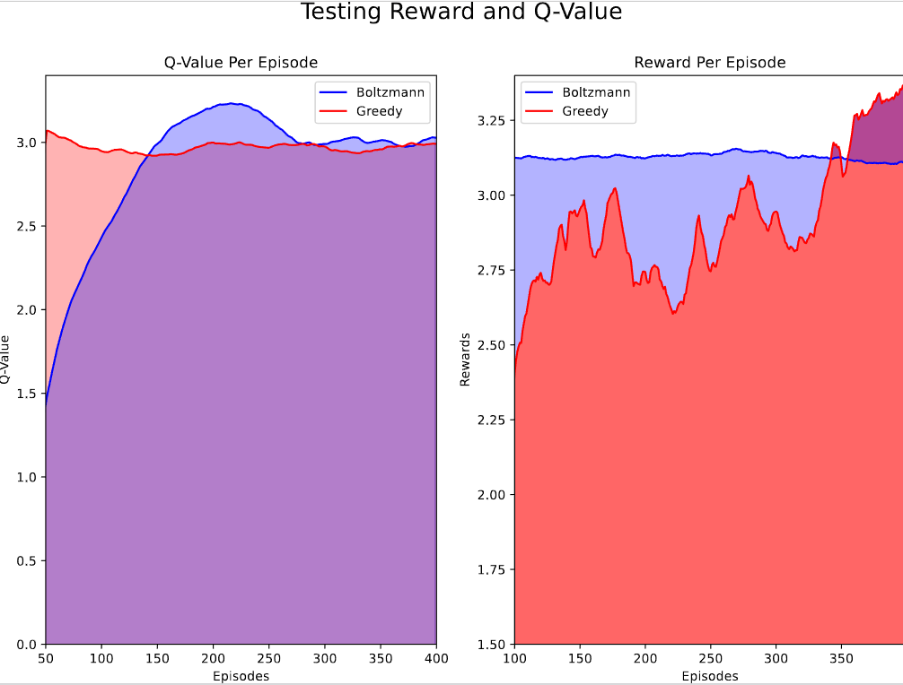

# Implementation for Implicit Sensing in Traffic Optimization: Advanced Deep Reinforcement Learning Techniques




This repo covers and replicates the methodology introduced in the paper. 

A quick overview of implementation and contributions from the paper:

> Developed a cohesive decision control framework for car-following and lane-changing operations utilizing DRL techniques.
> 
> Formulated the scenario in an MDP to employ a DQN
>
> Evaluate and contrast two distance decision-making policies, Boltzmann and Epsilon Greedy
>
> Created and integration between OpenAI GYM and SUMO, using TraCI

If you make use of this code in your publications please cite (https://ieeexplore.ieee.org/document/10437453)


## Whats included in this repo:

You can clone the repo and view ```Demo.ipynb``` to get started. 

It will have everything you need to understand and adapt the project.

It also includes a simple Deep Learning which can be adapted using the GYM Environment.

***IMPORTANT NOTE*** 

This repo makes use of older versions of Python for this reason please follow the installation instructions.

## Installation

This project best runs on Ubuntu 22.04

### Required System Packages:

1. [SUMO](https://sumo.dlr.de/docs/index.html) 

    Debian and Ubuntu, SUMO is part of the regular distro. 
    
    Install: ```sudo apt-get install sumo sumo-tools sumo-doc```

2. Python 3.7.17 
    
    Python 3.7.17 is needed due to ```tensorflow==2.1.0``` and ```keras-rl2``` ([KerasRL](https://github.com/inarikami/keras-rl2))

    Passing on Ubuntu 22.04 on 3.7.17
    
    


## Results from experiments in paper

More information can be found in the experimentation section of our paper, where we discuss the algorithms used and the environment set up.

  

## Author & Maintainer

Emanuel Figetakis

## Copyright and license

[LICENSE](LICENSE)

MIT License

Copyright (c) 2025 Emanuel Figetakis

